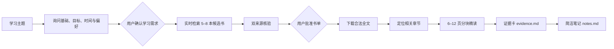

<p align="center">
  
</p>

<h1 align="center">build-book-study-notes</h1>

<p align="center">
  <strong>让 Codex 真正查书、下载书、按章读书，再写出可核验的中文学习笔记。</strong>
</p>

<p align="center">
  <a href="https://learn.chatgpt.com/docs/build-skills"></a>
  
  
  <a href="LICENSE"></a>
</p>

> 不是“根据模型记忆推荐几本书”，也不是把几百页 PDF 一次性塞进上下文。这个 Skill 会核验真实书目、等待你批准、保存合法全文，只精读与主题相关的章节，再从证据卡生成干净的 `notes.md`。

## 为什么做这个 Skill

普通的 AI 学习总结经常遇到四个问题：书籍或版本不可核验、没有真正读取正文、大型 PDF 占满上下文、笔记引用看似详细却无法追溯。

`build-book-study-notes` 为这些问题增加了明确约束：

| 问题 | 处理方式 |
|---|---|
| 书籍可能不存在或版本不明 | 每本候选书至少由两个独立来源核验 |
| AI 没有真正读到书 | 正文来源必须合法下载到本地并通过哈希校验 |
| 几百页 PDF 占满上下文 | 本地索引全文，只把相关章节按 6–12 页分块精读 |
| AI 擅自决定参考书 | 生成书单后强制暂停，必须由用户批准 |
| 笔记结构过度复杂 | `notes.md` 只保留学习正文和简短来源说明 |

## 工作流程



## 30 秒开始使用

### 1. 安装

在 Codex 中调用 `$skill-installer`，并输入：

```text
从 https://github.com/guan695/build-book-study-notes 安装仓库根目录的 Skill，名称使用 build-book-study-notes。
```

也可以直接克隆到用户级 Skills 目录。

Windows PowerShell：

```powershell
git clone https://github.com/guan695/build-book-study-notes.git "$env:USERPROFILE\.agents\skills\build-book-study-notes"
```

macOS / Linux：

```bash
git clone https://github.com/guan695/build-book-study-notes.git ~/.agents/skills/build-book-study-notes
```

如果安装后没有立即出现，请重启 Codex。

### 2. 发起学习任务

在任意正常工作目录中输入：

```text
$build-book-study-notes 我想学习卡尔曼滤波基础。我是初学者，希望用 1 小时入门，例子以公式和直观解释为主。
```

如果只提供主题，Skill 会先询问你的当前基础、目标程度、可用时间和讲解偏好，并等待你确认；不会静默套用默认配置，也不会提前搜索书籍。

### 3. 确认学习需求

信息收集完整后，Skill 会先复述本次学习范围和预期输出。确认无误后回复：

```text
确认，开始检索
```

在收到这次确认前，它不会联网搜索或创建学习产物。

### 4. 批准书单

第一阶段生成候选书单后会自动暂停。检查 `booklist.md`，然后回复：

```text
批准推荐书单
```

也可以指定书籍：

```text
批准 B01、B03、B05
```

批准后才会下载全文并生成正式笔记。

## 生成结果

所有运行结果默认写入当前工作目录：

```text
notes/
└── <日期>-<主题>/
    ├── sources.json   # 机器可读的来源、审批和文件记录
    ├── booklist.md    # 给用户确认的候选或获批书单
    ├── evidence.md    # 按页段整理的精读证据卡
    ├── notes.md       # 简洁的最终学习笔记
    └── materials/     # 实际用于笔记的原始书籍
```

日常阅读只需要打开 `notes.md`；其余文件用于重新生成和来源核验。

## 证据规则

- 候选书必须实时联网检索，不能依赖模型记忆虚构书目。
- 出版社、作者或机构官网、图书馆目录等可作为核验来源；零售页、搜索摘要和用户评论不能单独证明可靠性。
- `full_text` 才能支撑详细正文；`preview` 只使用实际可见内容；`metadata_only` 只能证明书籍身份与推荐价值。
- 不绕过付费墙，不使用盗版或影子图书馆。
- 如果合法正文不足，宁可只交付书单，也不伪装成已经读过书。

## 本地验证

清单校验器只使用 Python 标准库：

```powershell
python -X utf8 scripts/book_manifest.py --self-test
python -X utf8 scripts/book_manifest.py <sources.json> --check
python -X utf8 scripts/book_manifest.py <sources.json> --output <booklist.md>
```

它会检查必填字段、URL、ID 唯一性、ISBN 校验位、重复书目、独立证据域名、本地文件哈希、精读页段和来源列表。

## 适用范围

适合教材导读、技术主题入门、跨书概念综合和个人学习路线。它不是盗版下载器，也不能替代需要逐页完整研读的专业审校、医学诊断或法律意见。

## 参与改进

欢迎提交 Issue 或 Pull Request，尤其是不同操作系统上的安装体验、更多合法书源类型和新的真实学习主题试跑。

如果这个项目帮助你从“收藏书单”走到了“真正开始学习”，欢迎点一个 Star。

## License

[MIT](LICENSE)
